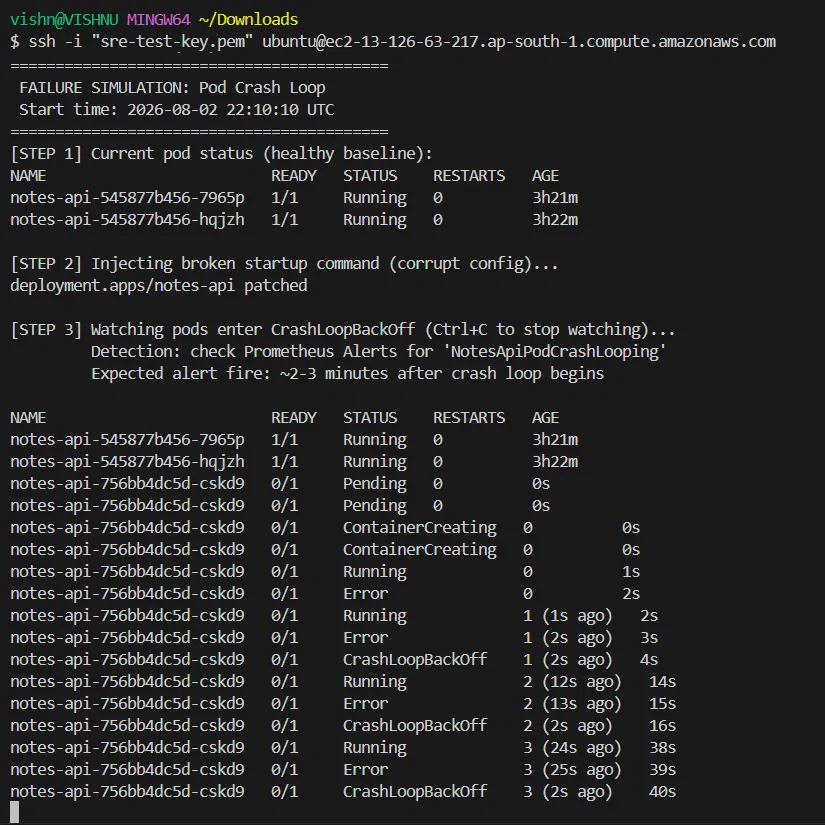
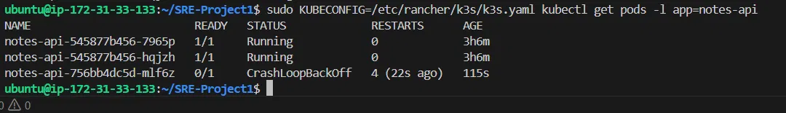
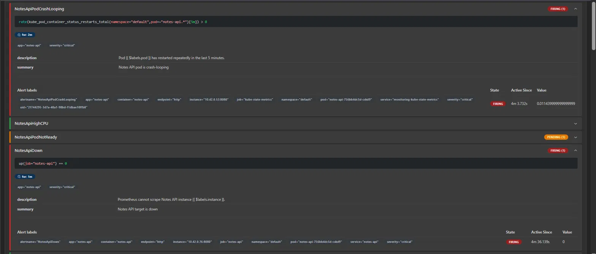
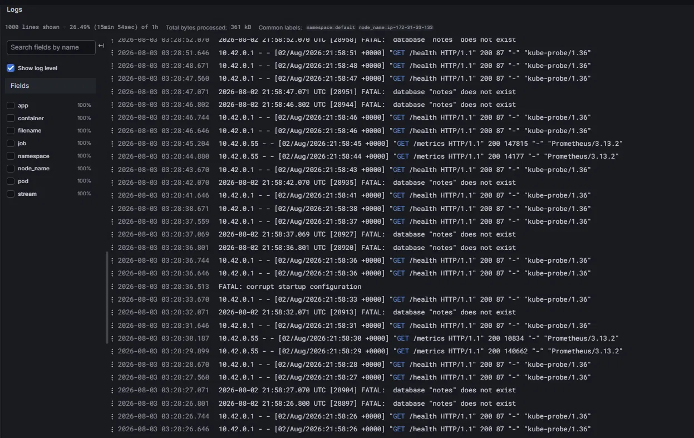
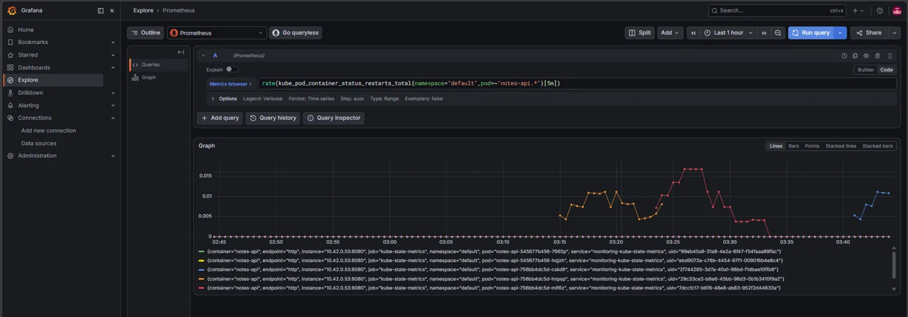
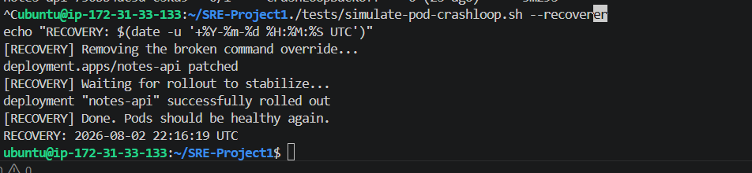

# RCA / Postmortem — Incident #1: Pod Crash Loop

| Field | Value |
|---|---|
| **Incident ID** | INC-001 |
| **Title** | Notes API replica set entering CrashLoopBackOff due to corrupt startup configuration |
| **Severity** | SEV-3 (degraded capacity; no user-facing outage due to HA) |
| **Status** | Resolved |
| **Author** | Vishnu K |
| **Date** | 2026-08-02 |
| **Simulated?** | Yes — controlled failure injection for resilience testing |
| **Primary alert** | `NotesApiPodCrashLooping` |

---

## 1. Summary

A corrupt startup configuration was injected into the `notes-api` Deployment by
overriding its container start command with a sequence that exits immediately
with a non-zero status. Kubernetes repeatedly attempted to start the new replica
set, which failed each time, entering **CrashLoopBackOff** with an exponential
backoff climbing to ~5m41s between attempts.

Critically, because the application runs **2 replicas** and Kubernetes uses a
rolling update strategy, the original healthy pods continued serving traffic for
the entire duration of the incident. **There was no user-facing outage** — high
availability held. The incident was detected by the `NotesApiPodCrashLooping`
alert and resolved by removing the broken command override.

---

## 2. Impact

- **User-facing:** None. The healthy replica set (`notes-api-545877b456-*`)
  continued serving all traffic. HA absorbed the failure.
- **Capacity:** Reduced redundancy during the incident — the app was effectively
  running on a single healthy replica set while the new one crash-looped.
- **Data:** No data loss.
- **Duration:** ~6 min 20 sec (injection to full recovery).

---

## 3. Timeline (UTC)

| Time | Event |
|---|---|
| 22:10:10 | **T+0** — Fault injected via `kubectl patch` (broken startup command) |
| 22:10:15 | New replica set begins cycling Running → Error → CrashLoopBackOff (~5s) |
| 22:10:38 | `NotesApiPodCrashLooping` enters **Pending** (first restart seen by kube-state-metrics) |
| 22:12:38 | Alert transitions to **Firing** — **time-to-detection: ~2m 28s** |
| 22:16:19 | Recovery initiated (`--recover` removes the broken command) |
| 22:16:30 | Deployment rollout stable; both pods `1/1 Running` |

---

## 4. Detection

- **Primary alert:** `NotesApiPodCrashLooping` — fires when the container restart
  rate over a 5-minute window exceeds zero, sustained for 2 minutes.
  Value at firing: **0.0114 restarts/sec**.
- **Secondary alerts observed:**
  - `NotesApiDown` — Prometheus could not scrape the failing pod's `/metrics`.
  - `NotesApiPodNotReady` — the crashing pod never stayed Ready long enough to
    satisfy its readiness probe (remained Pending during the incident).
- **Time-to-detection:** ~2 min 28 sec from injection to alert firing.

### Detection latency breakdown (a deliberate design tradeoff)

The ~2.5-minute detection floor is a composite of three intentional design choices:

| Component | Contribution |
|---|---|
| kube-state-metrics scrape interval | ~30s before the first restart is visible |
| PromQL `rate([5m])` window | needs multiple samples to compute a non-zero rate |
| Alert `for: 2m` clause | deliberate suppression of transient restart flaps |

This floor could be lowered (e.g. dropping `for:` to 30s) to detect faster, but
that would trade detection speed for **alert noise** — a single benign restart
would page an operator. The 2-minute suppression is a conscious
signal-vs-noise decision, not an oversight.

---

## 5. Root Cause Analysis (5 Whys)

- **Why did a replica set fail to run?**
  → The container exited immediately on start with a non-zero status.
- **Why did it exit immediately?**
  → Its startup command was overridden with a malformed sequence (echo → exit 1).
- **Why did that cause a crash loop?**
  → Kubernetes restarts failed containers with exponential backoff; a command that
    always fails produces an unbounded CrashLoopBackOff.
- **Why did the bad command reach the running Deployment?**
  → It was applied directly via `kubectl patch` (simulating a bad config change /
    corrupt image entrypoint / bad env in a real deploy).
- **Why can a single bad config take down a whole replica set despite HA?**
  → Because all replicas are identical — HA protects against *pod/node* failure,
    **not** against a *bad configuration* that every replica shares.
    **← Root cause: configuration errors are not caught before rollout, and are
    inherently non-redundant (they affect all replicas equally).**

---

## 6. What Went Well

- **HA held.** The rolling update strategy meant Kubernetes did not tear down the
  healthy pods until the new ones were Ready — which never happened — so users
  saw no downtime. This validated the 2-replica design.
- **Detection worked.** Three complementary alerts fired, correctly describing
  the failure from different angles (restart rate, scrape failure, not-ready).
- **Clean, fast recovery.** Removing the override triggered an automatic rolling
  update back to a healthy state in ~11 seconds.

---

## 7. What Could Be Improved

- **No pre-rollout config validation.** A bad command reached the cluster with no
  gate. CI could validate/smoke-test the image before deploy.
- **Detection floor of ~2.5 min** is acceptable but could be reduced for crash
  loops specifically with a dedicated faster rule if the noise tradeoff is accepted.
- **The `for: 2m` + `rate([5m])` combination**, while correct, means very fast
  crash loops still take minutes to alert — a `kube_pod_container_status_restarts_total`
  absolute-threshold rule could complement it.

---

## 8. Corrective Actions

| # | Action | Owner | Priority | Target Date |
|---|---|---|---|---|
| 1 | Document crash-loop response in the runbook (identify, inspect logs, rollback) | Vishnu K | High | 2026-08-04 |
| 2 | Add a CI smoke test that runs the built image and hits `/health` before deploy | Vishnu K | Medium | Backlog |
| 3 | Add a fast complementary alert on absolute restart count (>3 in 5m) | Vishnu K | Low | Backlog |
| 4 | Adopt `helm --atomic` on deploy so failed rollouts auto-rollback | Vishnu K | Medium | Backlog |

---

## 9. Incidental Finding (unrelated to this incident)

During log review, Loki surfaced a recurring line:
`FATAL: database "notes" does not exist`.

- **This is NOT caused by the crash-loop simulation.** It is pre-existing log noise.
- **Root cause identified:** the Postgres readiness/liveness probe runs
  `pg_isready -U notes` without specifying a database. `pg_isready` then defaults
  to probing a database named after the user (`notes`), which does not exist
  (the actual database is `notesdb`). `pg_isready` still returns
  "accepting connections", so the probe passes — the FATAL line is **harmless
  probe noise**, not a functional failure.
- **Fix (low priority):** change the probe to `pg_isready -U notes -d notesdb`
  to eliminate the misleading log line.
- **Why it matters:** flagged rather than ignored — investigating anomalies even
  when they aren't the current incident is core to good operations.

---

## 9. Evidence

### Injection & CrashLoopBackOff



### Alert firing


### Logs (Loki)


### Metric impact


### Recovery

---

## 11. Reproduction

```bash
ssh ubuntu@13.126.63.217
cd ~/SRE-Project1
./tests/simulate-pod-crashloop.sh
# wait ~3 min, observe NotesApiPodCrashLooping firing in Prometheus
./tests/simulate-pod-crashloop.sh --recover
```
