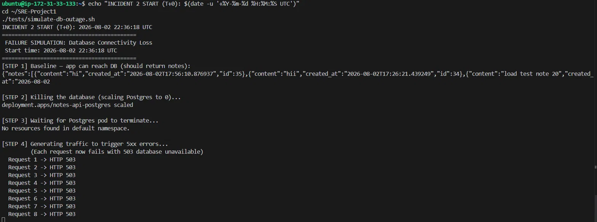
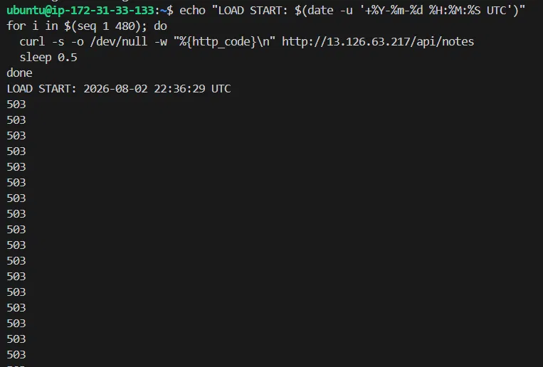
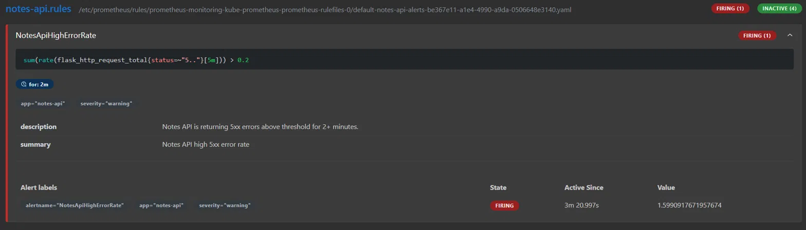
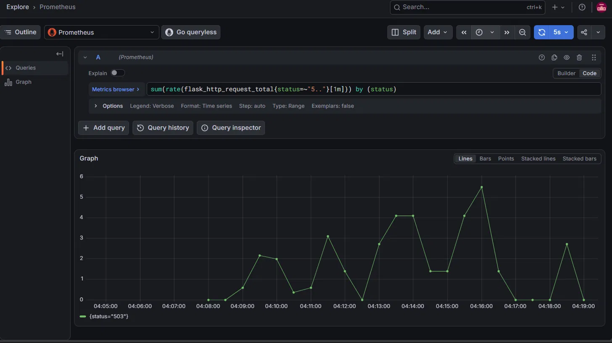
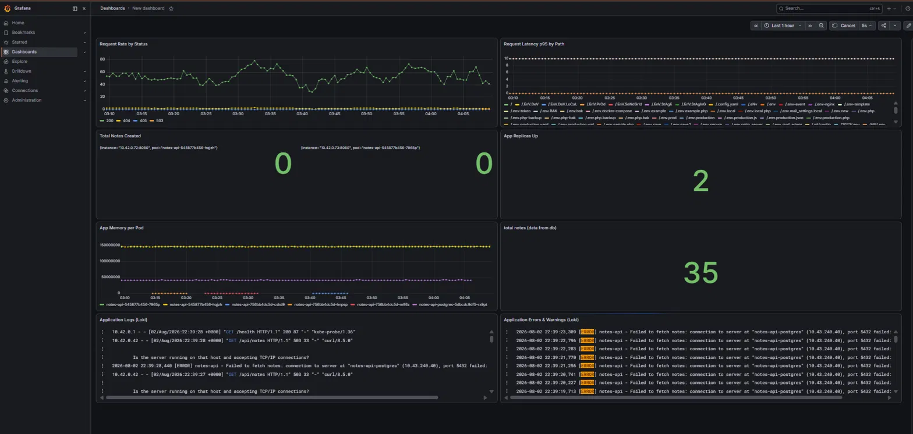
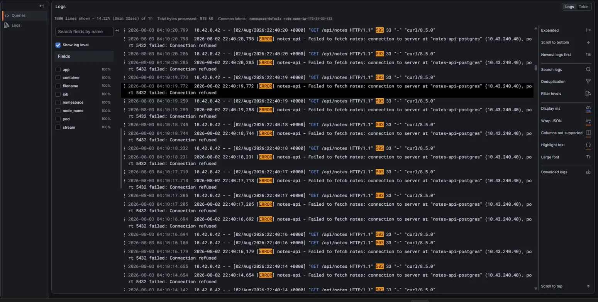
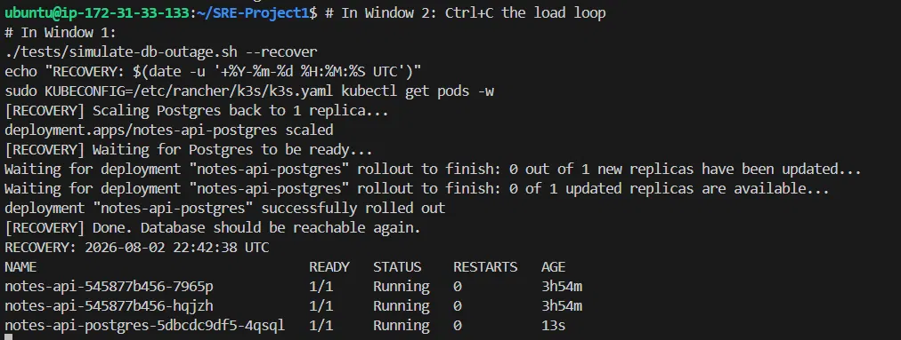
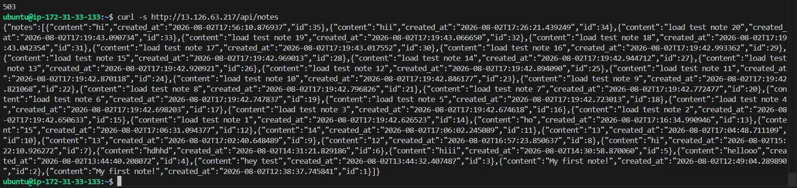

# RCA / Postmortem — Incident #2: Database Connectivity Loss

| Field | Value |
|---|---|
| **Incident ID** | INC-002 |
| **Title** | Notes API returning HTTP 503 on all DB-dependent endpoints during PostgreSQL outage |
| **Severity** | SEV-2 (major functionality unavailable; no data loss; app process healthy) |
| **Status** | Resolved |
| **Author** | Vishnu K |
| **Date** | 2026-08-02 |
| **Simulated?** | Yes — controlled failure injection for resilience testing |
| **Primary alert** | `NotesApiHighErrorRate` |

---

## 1. Summary

The PostgreSQL Deployment backing the Notes API was scaled to **zero replicas**,
simulating a complete database outage (e.g. a crash, an operator error, or a node
eviction). With the database unreachable, every request to the DB-dependent
endpoints (`GET`/`POST /api/notes`) returned **HTTP 503 "database unavailable"**.

Importantly, the application **degraded gracefully**: the app pods stayed
`1/1 Running` and continued returning `200` on `/health` throughout the outage.
The app logged the connection failure and returned a clean 503 rather than
crashing — meaning it was ready to serve the instant the database returned.

The incident was detected by the `NotesApiHighErrorRate` alert and resolved by
scaling PostgreSQL back to one replica.

---

## 2. Impact

- **User-facing:** All note listing and creation failed with HTTP 503 for the
  duration of the outage (100% failure rate on DB-dependent endpoints).
- **Not affected:** The application process stayed up; `/health` returned 200
  throughout (probes do not exercise the database).
- **Data:** No data loss. Existing notes remained intact on the persistent volume;
  they were served correctly immediately after recovery.
- **Duration:** ~6 min 20 sec (injection to verified recovery).

---

## 3. Timeline (UTC)

| Time | Event |
|---|---|
| 22:36:18 | **T+0** — Fault injected: `kubectl scale deployment/notes-api-postgres --replicas=0` |
| 22:36:29 | Load loop started; **first HTTP 503** returned immediately |
| 22:36:30 | `NotesApiHighErrorRate` enters **Pending** (5xx rate above 0.2 threshold) |
| 22:38:30 | Alert transitions to **Firing** — **time-to-detection: ~2m 12s** |
| 22:42:25 | Recovery initiated (`--recover` scales Postgres back to 1) |
| 22:42:38 | PostgreSQL pod Ready; `/api/notes` returns 200 again |

---

## 4. Detection

- **Primary alert:** `NotesApiHighErrorRate` — fires when the rate of 5xx
  responses over a 5-minute window exceeds 0.2 req/s, sustained for 2 minutes.
  Value at firing: **1.599 req/s** — roughly **8× the threshold**, so detection
  was unambiguous.
- **Supporting signals:**
  - Grafana "Request Rate by Status" showed a clear spike in 503 responses.
  - Loki captured the exact application error (see below).
- **Time-to-detection:** ~2 min 12 sec.

### Symptom-based vs cause-based detection (a deliberate discussion)

`NotesApiHighErrorRate` is a **symptom-based** alert — it detects that *users are
seeing 5xx errors*, regardless of the underlying cause. A **cause-based** alert
(e.g. "Postgres replica count == 0") would fire faster and pinpoint the database
directly.

Both have their place:
- **Symptom-based** catches this DB outage *and* any other failure class that
  produces 5xx (bad deploy, code bug, dependency timeout). Broad coverage.
- **Cause-based** is faster and more precise but only catches the specific cause
  it was written for.

A mature setup uses both: symptom alerts for coverage, cause alerts for speed and
precise triage. This is captured as a corrective action.

### Triage signal in the logs

Loki captured:
```
[ERROR] notes-api - Failed to fetch notes: connection to server at
"notes-api-postgres" (10.42.240.40), port 5432 failed: Connection refused
```

**"Connection refused"** (not "timed out") is a valuable triage signal: it means
nothing was listening on port 5432 at all — i.e. the Postgres pod was gone
(scaled to 0), **not** a network partition where packets are silently dropped
(which would manifest as a timeout). This distinction directs an on-call engineer
straight to "the DB process is down" rather than "investigate the network".

---

## 5. Root Cause Analysis (5 Whys)

- **Why did users get errors?**
  → The Notes API returned HTTP 503 on `/api/notes`.
- **Why did it return 503?**
  → The app could not connect to PostgreSQL (connection refused on port 5432).
- **Why was the connection refused?**
  → The PostgreSQL pod was not running (Deployment scaled to 0 replicas).
- **Why did a single scaling action take the whole feature down?**
  → PostgreSQL runs as a single-replica Deployment with no standby.
- **Why is there no standby / failover?**
  → The database tier has no HA design: single replica, no read replica, no
    point-in-time recovery. **← Root cause: the database is a single point of
    failure (SPOF) in the current architecture.**

**Contributing factor:** the app's liveness/readiness probes only check `/health`,
which does not exercise the database. So Kubernetes considered the app "ready" and
kept routing traffic to it even though its critical dependency was down. This is a
reasonable default (the app *is* alive and *does* recover), but it means the
platform layer had no independent signal of the DB dependency being broken.

---

## 6. What Went Well

- **Graceful degradation.** The app returned a clean 503 and kept its liveness
  probe green instead of crashing. This is by design — DB calls are wrapped in
  error handling with a 5-second connection timeout.
- **Zero-touch recovery.** Once the database returned, the app reconnected on the
  next request with no restart or manual intervention.
- **Overwhelming, unambiguous signal.** The 5xx rate was ~8× threshold, and the
  "connection refused" log made triage immediate.
- **No data loss.** The PVC preserved all notes; they were served correctly
  post-recovery (verified via `curl /api/notes`).

---

## 7. What Could Be Improved

- **Database is a SPOF** — no HA, no replica, no automated failover.
- **No cause-based DB alert** — detection was purely symptom-driven.
- **Probes don't reflect the DB dependency** — traffic kept routing to pods that
  could not fulfil requests. A DB-aware readiness check would let Kubernetes stop
  sending doomed requests.
- **Recovery was manual** (scale back up) — no automated remediation.

---

## 8. Corrective Actions

| # | Action | Owner | Priority | Target Date |
|---|---|---|---|---|
| 1 | Document DB-recovery steps in the runbook | Vishnu K | High | 2026-08-04 |
| 2 | Add a cause-based alert (`NotesApiDatabaseDown`) on Postgres replica count / availability for faster, precise detection | Vishnu K | Medium | Backlog |
| 3 | Add an optional DB-aware readiness gate so pods report NotReady when the DB is unreachable (stops routing doomed traffic) | Vishnu K | Medium | Backlog |
| 4 | For production: use managed or replicated PostgreSQL with automated failover + PITR backups | Platform team | High | Backlog |

---

## 9. Evidence

### Injection & 503 responses



### Alert firing


### Metric impact



### Logs (Loki)


### Recovery



---

## 10. Reproduction

```bash
ssh ubuntu@13.126.63.217
cd ~/SRE-Project1
./tests/simulate-db-outage.sh

# In a second SSH window — sustained load to keep the 5xx rate above threshold
# for the full alert-evaluation window:
for i in $(seq 1 480); do
  curl -s -o /dev/null -w "%{http_code}\n" http://13.126.63.217/api/notes
  sleep 0.5
done

# wait ~3 min, observe NotesApiHighErrorRate firing
# Ctrl+C the load loop, then recover:
./tests/simulate-db-outage.sh --recover
```

**Why sustained load is needed:** `NotesApiHighErrorRate` uses `rate([5m]) > 0.2`.
The script's built-in one-shot burst of 15 requests would not sustain that rate
across the 5-minute window. Continuous ~2 req/s load keeps the 5xx rate visible
for the full alert-evaluation window and mirrors a realistic outage where traffic
keeps arriving while the database is down.
